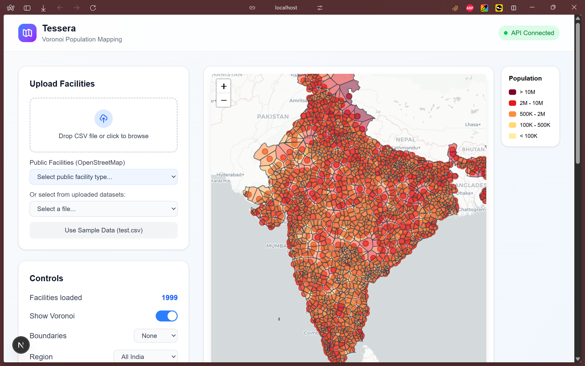

# Tessera

Tessera is a spatial analytics platform designed for policymakers, urban planners, and companies to optimize facility placement and aid in smart city planning. By leveraging Voronoi Diagrams and geospatial data, Tessera computes facilities catchment areas and provides insights into future planning.

## Why?

Policymakers and urban planners often need to heavily optimize facility placement to ensure equitable access to services, especially with essential services like emergency response centers, health centers, schools, etc.

Companies often need (and lack) information on the catchment of their facilities, and where they can open new facilities to maximize market reach. The company in this case can range all the way from a Max Hospital to a Dominos to a Reliance Retail Store.

From a consumer's point of view, our app helps them get insights about their locality, and how "smartly" it is planned, especially as we continue adding more essential services onto the app.

All of this is possible using the powerful Voronoi Diagrams, which mathematically and graphically define the areas each facility serves.

## Core Features

### Dynamic Catchment Computation
- **Voronoi Diagrams**: Automatically compute service areas for any set of facilities on an interactive map.
- **Dynamic Facility Management**: Add or remove facilities directly on the map to simulate "what-if" scenarios.
- **State Planning**: All diagrams and analyses can be performed at a country-level and at individual state-levels.

### Analysis and Insights
- **Population Integration**: Integrates population data to estimate the actual number of people served by each facility.
- **Population Density Insights**: Visualize underserved vs. over-burdened areas using color-coded heatmaps and Largest Empty Circles (LEC).
- **Data-Driven Recommendations**: Automated suggestions for facility relocation or expansion based on population load and service gaps.

### Data Exportability
- **Image Export**: Download current map views as PNG images for reports.
- **Geospatial Export**: Export computed Voronoi cells and population data as GeoJSON for further analysis in GIS tools.



## Tech Stack

### Frontend
- **Framework**: Next.js (React)
- **Mapping**: Leaflet with `react-leaflet`
- **Styling**: Tailwind CSS
- **Utilities**: html-to-image for map exports

### Backend
- **Framework**: FastAPI (Python)
- **GIS Engine**: GeoPandas and Shapely
- **Analysis**: SciPy (for Voronoi calculation) and NumPy
- **Data Handling**: Pandas for CSV and population processing

## Getting Started

You can view the app [here](https://tessera-chi.vercel.app/). If you want to run it locally, follow the instructions below.

### Prerequisites
- Python 3.9+
- Node.js 18+
- npm or yarn

### 1. Backend Setup
```bash
cd backend
python -m venv .venv
source .venv/bin/activate  # On Windows use: .venv\Scripts\activate
pip install -r requirements.txt
uvicorn app.main:app --reload --port 8000
```

### 2. Frontend Setup
```bash
cd frontend
npm install
npm run dev
```
Open [http://localhost:3000](http://localhost:3000) to view the application.

## Data Requirements
For custom facility analysis, upload a CSV with the following columns:
- `name`: Name of the facility
- `lat`: Latitude (decimal)
- `lng`: Longitude (decimal)
- `type` (Optional): Category of the facility
