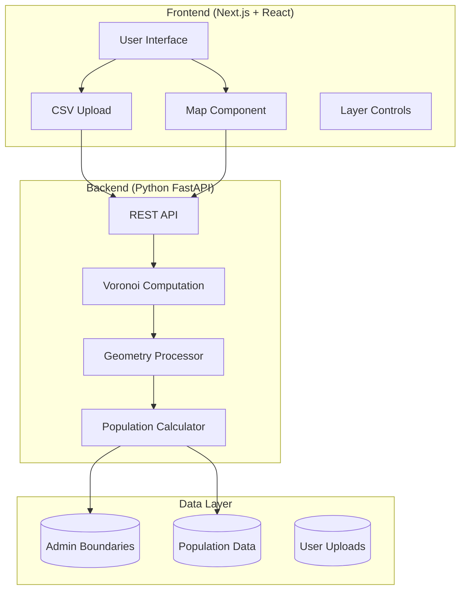

# Voronoi Population Mapping Application - Technical Specification

## Overview

A web application that:
1. Generates **Voronoi diagrams** for facility locations (hospitals, restaurants, etc.) on a map of India to visualize serviceable areas
2. Computes **weighted population estimates** for each Voronoi cell by intersecting with municipality/city boundaries and their population densities

---

## Core Concepts

### Voronoi Diagram
A Voronoi diagram partitions a plane into regions based on proximity to a set of seed points. Each region contains all points closer to its seed than to any other seed. For facilities, this means: *"Every location in this cell is closest to this particular facility."*

### Weighted Population Computation
When a Voronoi cell overlaps multiple administrative regions:
```
Cell Population = Σ (Area of intersection with region_i / Total area of region_i) × Population of region_i
```

---

## User Review Required

> [!IMPORTANT]
> **Data Source Decisions Required**
> - Where will municipality/city boundary shapefiles come from? (Census data, OpenStreetMap, Survey of India)
> - What granularity is needed? (District, Sub-district, City, Ward level)
> - Is population data already available, or do we need to source it?

> [!WARNING]
> **Google Maps API Considerations**
> - Google Maps API has usage-based pricing that can escalate quickly
> - Drawing custom polygons (Voronoi cells) on Google Maps is possible but limited
> - **Alternative**: Mapbox or Leaflet (OpenStreetMap-based) offer more flexibility for custom geometry rendering and are often more cost-effective

---

## Proposed Architecture



---

## Tech Stack Recommendation

### Frontend: Next.js + React ✅

**Why this is a good choice:**
- **Server-side rendering** for initial map load performance
- **API routes** can proxy requests to Python backend (avoiding CORS issues)
- Strong ecosystem for interactive UIs
- TypeScript support for type safety with GeoJSON structures

**Map Library Options:**

| Library | Pros | Cons |
|---------|------|------|
| **Mapbox GL JS** | Best for custom geometry, great performance, free tier generous | Requires API key, proprietary |
| **Leaflet + React-Leaflet** | Fully open source, lightweight, huge plugin ecosystem | Slightly less performant for complex polygons |
| **Google Maps** | Familiar, good geocoding | Expensive at scale, limited custom polygon styling |
| **Deck.gl** | Best for large datasets, WebGL rendering | Steeper learning curve |

**Recommendation**: **Mapbox GL JS** or **Leaflet** for flexibility with Voronoi polygon rendering.

---

### Backend: Python (FastAPI) ✅

**Why Python is ideal for this:**

1. **Geospatial Libraries are Best-in-Class**
   - `shapely` — Geometry operations (intersections, areas, buffers)
   - `geopandas` — Geospatial DataFrames, shapefile I/O
   - `scipy.spatial.Voronoi` — Core Voronoi computation
   - `pyproj` — Coordinate system transformations

2. **Scientific Computing Stack**
   - `numpy` for efficient numerical operations
   - Easy to prototype and iterate on algorithms

3. **FastAPI Advantages**
   - Async support for handling multiple concurrent requests
   - Automatic OpenAPI documentation
   - Type hints with Pydantic for request/response validation

**Alternative Considered: Node.js Backend**
- Possible with `turf.js` for geometry operations
- But Python's geospatial stack is more mature and performant for complex operations

---

## Proposed Components

### 1. Data Ingestion Module

**CSV Upload Format:**
```csv
id,name,latitude,longitude,type
1,Apollo Hospital,28.6139,77.2090,hospital
2,Max Healthcare,28.5672,77.2100,hospital
```

**Validation:**
- Coordinates within India's bounding box
- Required columns present
- Valid lat/long ranges

---

### 2. Voronoi Computation Engine

**Algorithm Steps:**
1. Parse input coordinates
2. Transform to a projected CRS (e.g., UTM zone for India) for accurate distance calculations
3. Compute Voronoi diagram using `scipy.spatial.Voronoi`
4. Handle infinite edges by clipping to a bounding polygon (India's boundary)
5. Transform back to WGS84 (lat/long) for map display

**Critical Consideration:**
> [!NOTE]
> Voronoi on lat/long directly is geometrically incorrect (treats Earth as flat). We must project to a local coordinate system, compute, then reproject back.

---

### 3. Population Weighting Engine

**Process:**
1. Load administrative boundary polygons with population data
2. For each Voronoi cell:
   - Find all intersecting admin regions
   - Compute intersection area
   - Calculate proportional population contribution
   - Sum weighted populations

**Pre-computation Strategy:**
- Admin boundaries and populations can be pre-indexed (R-tree spatial index)
- Voronoi cells are computed on-demand
- Intersection calculations are the bottleneck — consider caching

---

### 4. Map Visualization Layer

**Features:**
- Toggle layers (Voronoi cells, admin boundaries, facility markers)
- Color-code cells by weighted population
- Click on cell to see detailed breakdown
- Hover effects for interactivity
- Legend with population ranges

---

## Data Requirements

### Administrative Boundaries

| Source | Granularity | Format | Notes |
|--------|-------------|--------|-------|
| Census of India | District, Sub-district | Shapefiles | Official but may need licensing |
| OpenStreetMap | Varies | GeoJSON | Free, community-maintained |
| GADM | Country to district | Shapefiles | Research-grade, free for non-commercial |
| DataMeet India | Multiple levels | Various | Open data community |

### Population Data

- Census 2011 (most recent complete census)
- Projected population estimates (2021+)
- Need to join population figures to boundary geometries

---

## API Design

### Endpoints

```
POST /api/voronoi/compute
  Body: { facilities: [{lat, lng, name, ...}], clip_to_india: bool }
  Response: GeoJSON FeatureCollection of Voronoi polygons

POST /api/population/weighted
  Body: { voronoi_geojson: FeatureCollection }
  Response: { cells: [{id, weighted_population, breakdown: [...]}] }

GET /api/boundaries/{level}
  Params: level = "district" | "subdistrict" | "city"
  Response: GeoJSON of admin boundaries

POST /api/upload/csv
  Body: multipart form with CSV file
  Response: { facilities: [...], errors: [...] }
```

---

## Performance Considerations

| Operation | Complexity | Mitigation |
|-----------|------------|------------|
| Voronoi computation | O(n log n) | Fast, not a concern |
| Clipping to India boundary | Moderate | Pre-simplify India boundary |
| Polygon intersection | O(n × m) where n=cells, m=admin regions | R-tree spatial index |
| Frontend rendering | Many complex polygons | Simplify geometries, use WebGL (Deck.gl) |

**Caching Strategy:**
- Cache admin boundaries in memory on backend startup
- Consider Redis for caching computed Voronoi results if same inputs repeat

---

## Project Structure

```
voronoi-population-app/
├── frontend/                    # Next.js application
│   ├── app/
│   │   ├── page.tsx            # Main map interface
│   │   └── api/                # API route proxies
│   ├── components/
│   │   ├── Map/
│   │   ├── FileUpload/
│   │   └── LayerControls/
│   └── lib/
│       └── api.ts              # Backend API client
│
├── backend/                     # Python FastAPI
│   ├── app/
│   │   ├── main.py             # FastAPI app entry
│   │   ├── routers/
│   │   │   ├── voronoi.py
│   │   │   ├── population.py
│   │   │   └── boundaries.py
│   │   ├── services/
│   │   │   ├── voronoi_engine.py
│   │   │   ├── population_calc.py
│   │   │   └── geo_utils.py
│   │   └── data/
│   │       └── boundaries/     # Pre-loaded shapefiles
│   └── requirements.txt
│
└── data/                        # Static data assets
    ├── india_boundary.geojson
    ├── districts.geojson
    └── population_census.csv
```

---

## Open Questions for You

1. **Map Provider Preference**: Google Maps (familiar but costly) vs. Mapbox/Leaflet (flexible, cheaper)?

2. **Boundary Granularity**: What level of administrative boundary is needed?
   - State → District → Sub-district → City/Town → Ward
   - Finer granularity = more accurate but more data/computation

3. **Population Data Source**: Do you have access to population data, or should we identify open sources?

4. **Deployment Target**: 
   - Cloud (Vercel + AWS/GCP for backend)?
   - On-premise?

5. **Offline Capability**: Should the app work without internet (progressive web app)?

6. **Scale**: How many facilities typically? (10s, 100s, 1000s affect performance decisions)

---

## Implementation Phases

### Phase 1: Core MVP
- [ ] Basic map display with India boundary
- [ ] CSV upload and coordinate plotting
- [ ] Voronoi computation and visualization
- [ ] Single admin boundary level (district)

### Phase 2: Population Integration
- [ ] Load and display admin boundaries
- [ ] Intersection computation
- [ ] Weighted population display
- [ ] Click-to-see-details interaction

### Phase 3: Polish & Features
- [ ] Multiple boundary granularities
- [ ] Export functionality (PNG, GeoJSON)
- [ ] Layer toggles and styling options
- [ ] Performance optimization

---

## Summary

| Component | Technology | Rationale |
|-----------|------------|-----------|
| Frontend Framework | Next.js + React | SSR, API routes, great DX |
| Map Library | Mapbox GL JS or Leaflet | Custom polygon support, cost-effective |
| Backend Framework | Python FastAPI | Best geospatial libraries, async |
| Geospatial | shapely, geopandas, scipy | Industry standard, mature |
| Data Format | GeoJSON | Universal, frontend-friendly |

This stack provides the right balance of **developer productivity**, **geospatial capability**, and **cost-effectiveness** for your use case.
